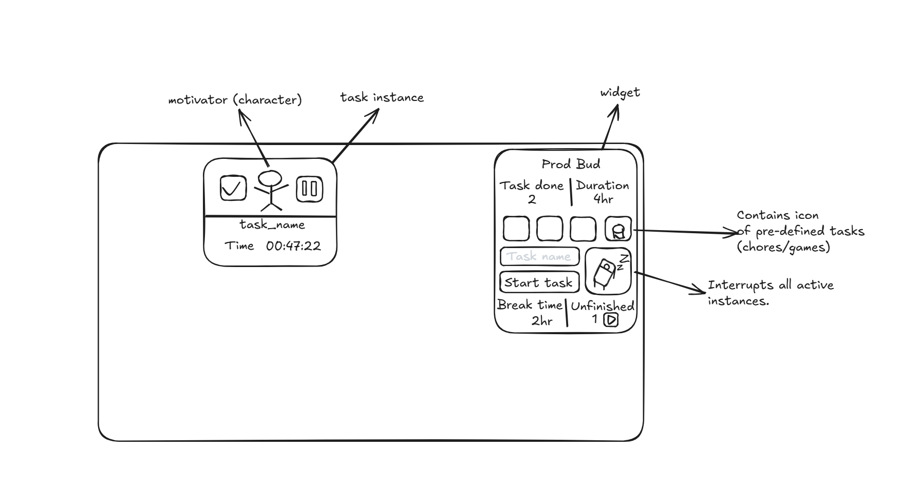

# ProdBud

A lightweight desktop productivity overlay: an always-on-top **widget** plus floating **task cards** with
live timers and a little motivator character. Every task and break is logged as Markdown into your
**Obsidian** vault (no plugin needed; the notes are Dataview-friendly).



Built with Electron and targeted at Windows. The full spec is in [prodbud_plan.md](prodbud_plan.md).

## Features

- **Widget** (docked bottom-right, draggable by its title): Tasks done, Duration, Break time and Unfinished
  counters for today, preset buttons, a task name field and **Start task**
- **Task cards**: one floating, draggable card per task with ✔ finish, ⏸ pause/resume and a live `HH:MM:SS` timer
  that excludes paused time. The motivator works, sits while paused, waves at you after a long pause, and
  celebrates when you finish
- **Nap button**: interrupts every running task (they move to *Unfinished*), then counts break time.
  Tap again to wake up, and you'll be offered **Resume all**
- **Break-kind presets** (e.g. Gaming): get a card and timer, count toward Break time instead of
  Duration, and interrupt running work just like the nap button
- **Unfinished list** (▶): resume or discard tasks that were interrupted, closed, or left paused for
  30+ minutes. Resumed tasks keep adding up time
- **Categories**: add a trailing tag when typing a task name, e.g. `Study Rust #study`
- **Crash-safe**: state is written atomically on every change, and running/paused tasks come back on restart
- **Tray icon**, global hotkey (`Ctrl+Alt+P` by default), and a *Launch on startup* toggle in the tray menu

## Getting started (Windows)

Clone the repo to a Windows folder (not inside WSL), then:

```bash
npm install
```

```bash
npm start
```

To build an installer and a portable `.exe` into `dist/`:

```bash
npm run dist
```

## Configuration: pointing ProdBud at your vault

Everything lives in [`config.yaml`](config.yaml). Set `vaultPath` to the folder that contains `.obsidian`:

```yaml
vaultPath: 'C:\Users\you\Documents\MyVault'
```

- Logging is off while `vaultPath` is empty (a ⚠ appears next to the widget title).
- To keep personal settings out of git, copy the file to `%APPDATA%\ProdBud\config.yaml`; that copy wins.
  Installed builds create this copy automatically on first run.
- Tray → **Reload config** applies changes without restarting.
- Config lookup order lives in [`src/main/config.js`](src/main/config.js); the vault writer is
  [`src/main/obsidian.js`](src/main/obsidian.js).

Other settings: `logFolder`, `dailyNotes` (enabled / folder / heading), `autoUnfinishMin` (30),
`nudgeAfterMin` (10), `hotkey`, and `presets`.

## What gets written to the vault

| File | When |
|---|---|
| `ProdBud/<date> <HHmm> <task>.md` | A task finishes or becomes unfinished (the note is rewritten with the latest totals) |
| `ProdBud/<date> <HHmm> Nap.md` | A nap break ends |
| `<daily folder>/YYYY-MM-DD.md` | One line appended under `## ProdBud Log` for each of the above |
| `ProdBud Stats.md` | Created once, with Dataview queries: today, work/breaks per day this week, time by category, unfinished |

```markdown
- 14:32–15:17 · **Wash dishes** · #chores · 31m ✅
- 15:20–15:45 · 💤 Break · 25m (interrupted 2 tasks)
- 16:00–16:45 · 🎮 Gaming · 45m (break)
```

## Development

```bash
npm test
```

| Path | What |
|---|---|
| `src/main/store.js` | Task/break state machine (segments, nap, interrupts, stats); pure and unit-tested |
| `src/main/obsidian.js` | Markdown notes, daily-note lines, stats note |
| `src/main/main.js` | Electron windows, IPC, tray, hotkey, persistence |
| `src/renderer/` | Widget, task card, and motivator character (inline SVG) |

App state is kept in `%APPDATA%\ProdBud\state.json`.
